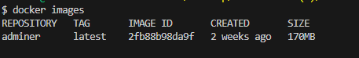
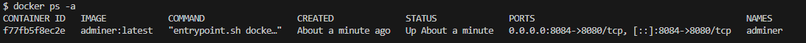
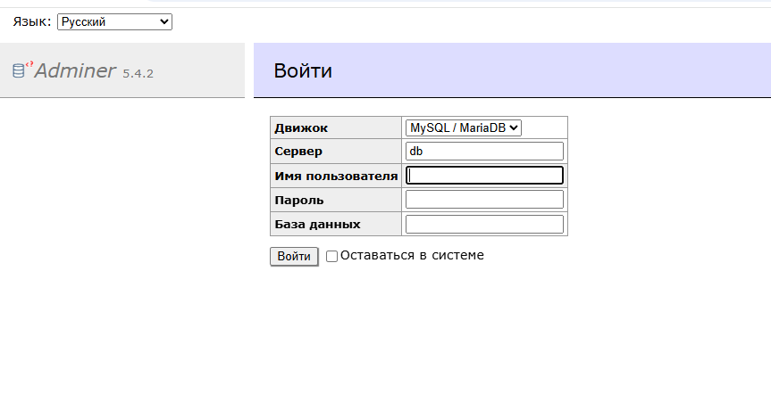
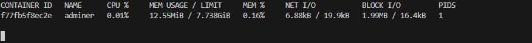
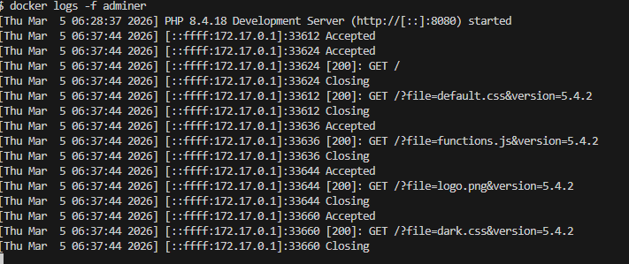

##  Проверить Docker
Получить версию установленного у вас Docker
```bash
docker version
```


## Подготовка Docker (чтобы начать работать с “чистого листа”)
Остановить все запущенные контейнеры
Удалить все остановленные контейнеры
Удалить все неиспользуемые образы

- Следует убедиться, нет ли у вас уже установленных и запущенных контейнеров:
```bash
docker ps -a
```
- Если есть, то лучше их остановить:
```bash
docker stop $(docker ps -q)
```
- Если остановленные контейнеры не нужно, то удалить их:
```bash
docker container prune
```
или
```bash
docker container prune $(docker ps -q)
```
- Ещё раз убедиться, что нет лишних контейнеров:
```bash
docker ps -a
```


- Опционально можно удалить ненужные образы. Показать текущие образы:
```bash
docker images
```
- Удалить все ненужные образы
```bash
docker image prune -a
```
или
```bash
docker rmi $(docker images -q)
```

## Поиск готового образа Adminer
```bash
docker run -d \
  --name adminer \
  -p 8084:8080 \
  adminer:latest
```

##  Получение готового образа Adminer

Получить информацию по загруженному образу:
```bash
docker inspect adminer
```
При необходимости остановить контейнер с таким именем:
```bash
docker stop adminer
```
Перезапустить контейнер по имени
```bash
docker restart adminer
```
Перезапустить контейнер по его id
```bash
docker restart 2fb88b98da9f
```
Удалить выбранный контейнер по его имени
```bash
docker rm adminer
```


И можно удалить ещё и образ загруженного ранее adminer:

Получить id образа
```bash
docker images
```
Удалить по id нужный образ
```bash
docker rmi 2fb88b98da9f
```


## Проверить работу контейнера

Можно снова установить и запустить Adminer (если его удаляли ранее)
```bash
docker run -d \
  --name adminer \
  -p 8084:8080 \
  adminer:latest
```
Показать наличие загруженного файла образа
```bash
docker images
```


Показать только запущенные контейнеры
```bash
docker ps
```
или показать все контейнеры (в т.ч. остановленные)
```bash
docker ps -a
```


Проверить порт 8084 для Linux/Mac/WSL:
```bash
# Проверьте, занят ли порт
netstat -tuln | grep :8084
```
Проверить порт 8040 для Windows:
```bash
netstat -aon | findstr :8084
```
Откройте: http://localhost:8084



## Управление контейнером
Показать состояние всех контейнеров
```bash
docker ps -a
```
Показать подробности о контейнере
```bash
docker inspect adminer
```
Запустить мониторинг контейнеров
```bash
docker stats
```


Получить лог контейнера
```bash
docker logs adminer
```
Показать логи в режиме ожидания
```bash
docker logs -f adminer
```


Остановить контейнер
```bash
docker stop adminer
```
Снова запустить контейнер
```bash
docker start adminer
```
Перезапустить контейнер
```bash
docker restart adminer
```
Зайти в контейнер
```bash
docker exec -it adminer /bin/bash
```
или
```bash
docker exec -it adminer bash
```
или
```bash
docker exec -it adminer /bin/sh
```
или
```bash
docker exec -it adminer sh
```
внутри контейнера можно повыполнять некоторые команды Linux Получить информацию об ОС контейнера
```bash
uname -a
```


Получить больше информации об ОС контейнера
```bash
cat /etc/os-release
```


Выйти из контейнера можно командой exit

Остановить все запущенные контейнеры
```bash
docker stop $(docker ps -q)
```
Удалить все остановленные контейнеры
```bash
docker container prune $(docker ps -q)
```
Удалить все образы
```bash
docker rmi $(docker images -q)
```