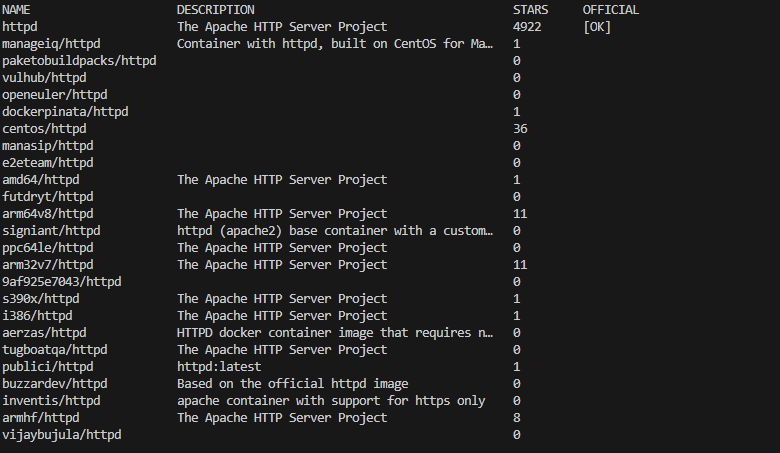
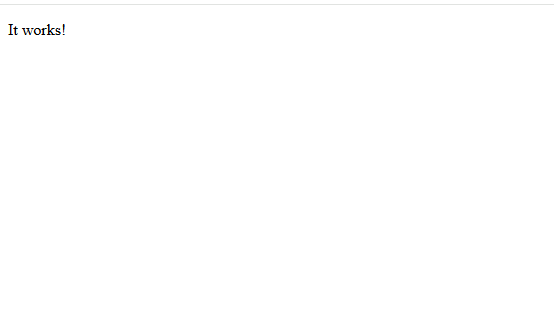
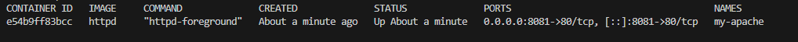
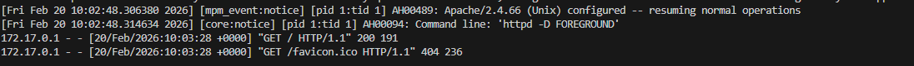

# Работа с Docker и Apache из готового образа

Цель: описать все шаги по запуску Apache внутри Docker-контейнера на основе готового образа, используя пример с Debian и веб-сервером Apache.

## 1. Поиск готового образа Apache с Debian (самый первый по списку)

В Docker Hub есть несколько образов с Apache. Обычно самый простой путь — официальный образ httpd, который базируется на Debian/Alpine. В примере ниже использован образ httpd. При необходимости уточните конкретный тег.

- Поиск образа (не обязательно, на практике используйте напрямую команду ниже):
```bash
docker search httpd
```


- Пример выбора образа и запуска контейнера (самый простой вариант — официальный образ httpd):
```bash
docker run -d --name my-apache -p 8081:80 httpd
```

Примечание: данная команда запускает контейнер в фоновом режиме, пробрасывает порт 80 внутри контейнера на порт 8081 на хосте, и дает имя контейнеру my-apache.

## 3. Проверка работы Apache в контейнере

- Откройте браузер и перейдите по адресу:
```
http://localhost:8081
```

- Вы должны увидеть стартовую страницу Apache (Welcome/It works).

Если доступ не работает:
- Убедитесь, что контейнер запущен:
```bash
docker ps
```

- Проверьте логи:
```bash
docker logs my-apache
```

## 4. Установка образа Apache и запуск контейнера (повтор)

Если образ не был загружен, загрузите его и запустите контейнер повторно:

```bash
docker pull httpd:latest
docker rm -f my-apache 2>/dev/null || true
docker run -d --name my-apache -p 8081:80 httpd
```

Пояснение:
- docker pull httpd:latest — скачивает последний официальный образ Apache.
- docker rm -f my-apache — удаляет существующий контейнер с тем же именем (если нужно).
- docker run -d --name my-apache -p 8081:80 httpd — запускает новый контейнер.

## 5. Оформление шагов в Markdown с поддержкой скриншотов

- Сделайте скриншоты на каждом шаге:
  1) вывод команды clone/создания репозитория.
  2) вывод содержимого каталога после создания файла Apache.md.
  3) выполнение docker run с именем контейнера и портом.
  4) результат в браузере (страница http://localhost:8081).
  5) результаты docker ps и docker logs, если есть проблемы.

- Вставьте скриншоты в файл Apache.md в виде изображений (Markdown-формат).

Пример вставки изображений в Markdown:
```markdown

```

Совет: храните изображения в подпапке screenshots рядом с Apache.md, например:
- myNotes/screenshots/step3_run.png
- myNotes/screenshots/step4_browser.png
- myNotes/screenshots/step5_logs.png

## 6. Отправка ссылки на удалённый репозиторий

После завершения:
- Сделайте коммиты и запушьте в удалённый репозиторий.

```bash
git add myNotes/Apache.md
git add myNotes/screenshots/*
git commit -m "Документация: запуск Apache в Docker из готового образа"
git push origin main  # или другая ветка
```

- Сгенерируйте ссылку на удалённый репозиторий и отправьте преподавателю.