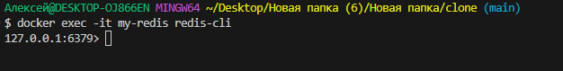
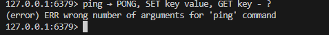

##  Проверить Docker
Получить версию установленного у вас Docker
```bash
docker version
```


## Подготовка Docker (чтобы начать работать с “чистого листа”)
Остановить все запущенные контейнеры
Удалить все остановленные контейнеры
Удалить все неиспользуемые образы

- Следует убедиться, нет ли у вас уже установленных и запущенных контейнеров:
```bash
docker ps -a
```
- Если есть, то лучше их остановить:
```bash
docker stop $(docker ps -q)
```
- Если остановленные контейнеры не нужно, то удалить их:
```bash
docker container prune
```
или
```bash
docker container prune $(docker ps -q)
```
- Ещё раз убедиться, что нет лишних контейнеров:
```bash
docker ps -a
```


- Опционально можно удалить ненужные образы. Показать текущие образы:
```bash
docker images
```
- Удалить все ненужные образы
```bash
docker image prune -a
```
или
```bash
docker rmi $(docker images -q)
```

## Поиск готового образа Redis
```bash
docker run -d --name my-redis -p 6379:6379 redis:alpine
```

##  Получение готового образа Redis

Получить информацию по загруженному образу:
```bash
docker inspect smy-redis
```
При необходимости остановить контейнер с таким именем:
```bash
docker stop my-redis
```
Перезапустить контейнер по имени
```bash
docker restart my-redis
```
Перезапустить контейнер по его id
```bash
docker restart 2afba59292f2
```
Удалить выбранный контейнер по его имени
```bash
docker rm my-redis
```


И можно удалить ещё и образ загруженного ранее Redis:

Получить id образа
```bash
docker images
```
Удалить по id нужный образ
```bash
docker rmi 2afba59292f2
```


## Проверить работу контейнера

Можно снова установить и запустить Redis (если его удаляли ранее)
```bash
docker run -d --name my-redis -p 6379:6379 redis:alpine
```
Показать наличие загруженного файла образа
```bash
docker images
```


Показать только запущенные контейнеры
```bash
docker ps
```
или показать все контейнеры (в т.ч. остановленные)
```bash
docker ps -a
```


Подключиться к Redis CLI
```bash
docker exec -it my-redis redis-cli
```



Внутри Redis:
```
ping → PONG, SET key value, GET key - ?
```



Остановить все запущенные контейнеры
```bash
docker stop $(docker ps -q)
```
Удалить все остановленные контейнеры
```bash
docker container prune $(docker ps -q)
```
Удалить все образы
```bash
docker rmi $(docker images -q)
```