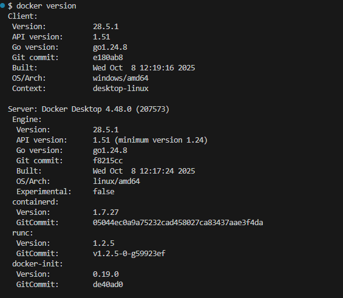
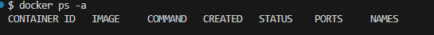
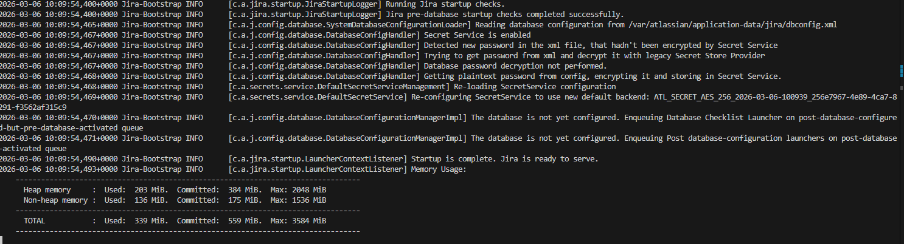

##  Проверить Docker
Получить версию установленного у вас Docker
```bash
docker version
```



## Подготовка Docker (чтобы начать работать с “чистого листа”)
Остановить все запущенные контейнеры
Удалить все остановленные контейнеры
Удалить все неиспользуемые образы

- Следует убедиться, нет ли у вас уже установленных и запущенных контейнеров:
```bash
docker ps -a
```
- Если есть, то лучше их остановить:
```bash
docker stop $(docker ps -q)
```
- Если остановленные контейнеры не нужно, то удалить их:
```bash
docker container prune
```
или
```bash
docker container prune $(docker ps -q)
```
- Ещё раз убедиться, что нет лишних контейнеров:
```bash
docker ps -a
```


- Опционально можно удалить ненужные образы. Показать текущие образы:
```bash
docker images
```
- Удалить все ненужные образы
```bash
docker image prune -a
```
или
```bash
docker rmi $(docker images -q)
```
# Поиск готового образа Jira
```bash
docker run -d --name jira -p 2990:8080 atlassian/jira-software:latest

```

или

```bash
docker run -d --name jira -p 2990:8080 addono/jira-software-standalone
```

внутри контейнера можно повыполнять некоторые команды Linux Получить информацию об ОС контейнера

## Открыть лог в Jira
```bash
docker logs -f jira
```



Выйти из контейнера можно командой exit

Остановить все запущенные контейнеры
```bash
docker stop $(docker ps -q)
```
Удалить все остановленные контейнеры
```bash
docker container prune $(docker ps -q)
```
Удалить все образы
```bash
docker rmi $(docker images -q)
```