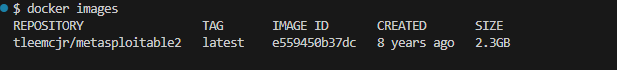
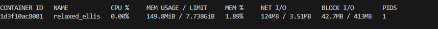

##  Проверить Docker
Получить версию установленного у вас Docker
```bash
docker version
```


## Подготовка Docker (чтобы начать работать с “чистого листа”)
Остановить все запущенные контейнеры
Удалить все остановленные контейнеры
Удалить все неиспользуемые образы

- Следует убедиться, нет ли у вас уже установленных и запущенных контейнеров:
```bash
docker ps -a
```
- Если есть, то лучше их остановить:
```bash
docker stop $(docker ps -q)
```
- Если остановленные контейнеры не нужно, то удалить их:
```bash
docker container prune
```
или
```bash
docker container prune $(docker ps -q)
```
- Ещё раз убедиться, что нет лишних контейнеров:
```bash
docker ps -a
```


- Опционально можно удалить ненужные образы. Показать текущие образы:
```bash
docker images
```
- Удалить все ненужные образы
```bash
docker image prune -a
```
или
```bash
docker rmi $(docker images -q)
```

## Поиск готового образа Metasploitable2
```bash
docker pull tleemcjr/metasploitable2
```

##  Получение готового образа Metasploitable2

Получить информацию по загруженному образу:
```bash
docker inspect metasploitable2
```
При необходимости остановить контейнер с таким именем:
```bash
docker stop metasploitable2
```
Перезапустить контейнер по имени
```bash
docker restart metasploitable2
```
Перезапустить контейнер по его id
```bash
docker restart e559450b37dc
```
Удалить выбранный контейнер по его имени
```bash
docker rm metasploitable2
```


И можно удалить ещё и образ загруженного ранее Metasploitable2:

Получить id образа
```bash
docker images
```
Удалить по id нужный образ
```bash
docker rmi e559450b37dc
```


## Проверить работу контейнера

Можно снова установить и запустить Ubuntu (если его удаляли ранее)
```bash
docker pull tleemcjr/metasploitable2
```
Показать наличие загруженного файла образа
```bash
docker images
```


Показать только запущенные контейнеры
```bash
docker ps
```
или показать все контейнеры (в т.ч. остановленные)
```bash
docker ps -a
```


## Управление контейнером
Мониторинг контейнеров
Показать состояние всех контейнеров
```bash
docker ps -a
```
Показать подробности о контейнере
```bash
docker inspect metasploitable2
```
Запустить мониторинг контейнеров
```bash
docker stats
```


Получить лог контейнера
```bash
docker logs metasploitable2
```
Показать логи в режиме ожидания
```bash
docker logs -f metasploitable2
```


Остановить контейнер
```bash
docker stop metasploitable2
```
Снова запустить контейнер
```bash
docker start metasploitable2
```
Перезапустить контейнер
```bash
docker restart metasploitable2
```
Зайти в контейнер
```bash
docker exec -it metasploitable2 /bin/bash
```
или
```bash
docker exec -it metasploitable2 bash
```
или
```bash
docker exec -it metasploitable2 /bin/sh
```
или
```bash
docker exec -it metasploitable2 sh
```
внутри контейнера можно повыполнять некоторые команды Linux Получить информацию об ОС контейнера
```bash
uname -a
```


Получить больше информации об ОС контейнера
```bash
cat /etc/os-release
```


Выйти из контейнера можно командой exit

Остановить все запущенные контейнеры
```bash
docker stop $(docker ps -q)
```
Удалить все остановленные контейнеры
```bash
docker container prune $(docker ps -q)
```
Удалить все образы
```bash
docker rmi $(docker images -q)
```