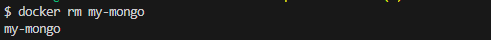
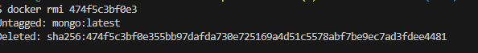
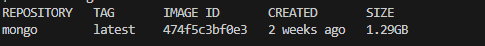
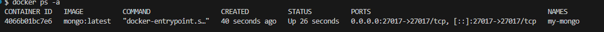
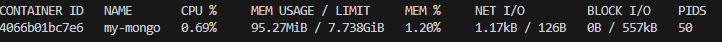
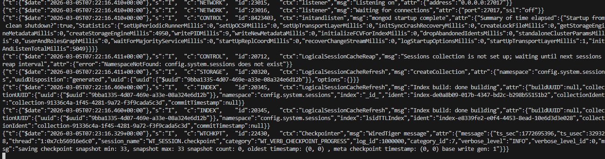
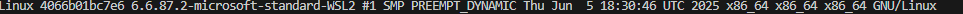
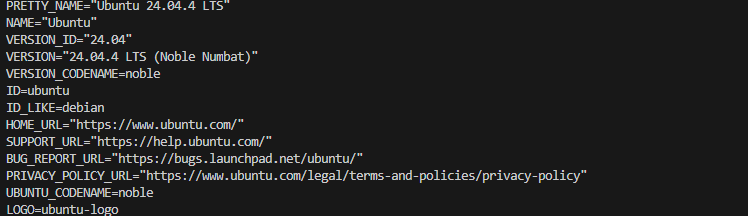
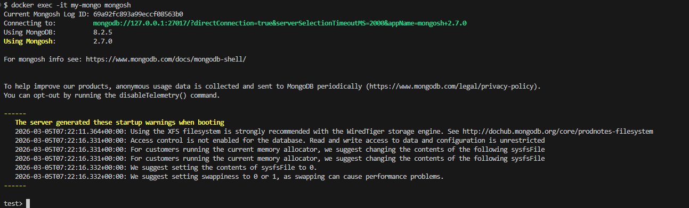

##  Проверить Docker
Получить версию установленного у вас Docker
```bash
docker version
```


## Подготовка Docker (чтобы начать работать с “чистого листа”)
Остановить все запущенные контейнеры
Удалить все остановленные контейнеры
Удалить все неиспользуемые образы

- Следует убедиться, нет ли у вас уже установленных и запущенных контейнеров:
```bash
docker ps -a
```
- Если есть, то лучше их остановить:
```bash
docker stop $(docker ps -q)
```
- Если остановленные контейнеры не нужно, то удалить их:
```bash
docker container prune
```
или
```bash
docker container prune $(docker ps -q)
```
- Ещё раз убедиться, что нет лишних контейнеров:
```bash
docker ps -a
```


- Опционально можно удалить ненужные образы. Показать текущие образы:
```bash
docker images
```
- Удалить все ненужные образы
```bash
docker image prune -a
```
или
```bash
docker rmi $(docker images -q)
```

## Поиск готового образа MongoDB
```bash
docker run -d \
  --name my-mongo \
  -p 27017:27017 \
  mongo:latest
```

##  Получение готового образа MongoDB

Получить информацию по загруженному образу:
```bash
docker inspect my-mongo
```
При необходимости остановить контейнер с таким именем:
```bash
docker stop my-mongo
```
Перезапустить контейнер по имени
```bash
docker restart my-mongo
```
Перезапустить контейнер по его id
```bash
docker restart 474f5c3bf0e3
```
Удалить выбранный контейнер по его имени
```bash
docker rm my-mongo
```


И можно удалить ещё и образ загруженного ранее MongoDB:

Получить id образа
```bash
docker images
```
Удалить по id нужный образ
```bash
docker rmi 474f5c3bf0e3
```


## Проверить работу контейнера

Можно снова установить и запустить MongoDB (если его удаляли ранее)
```bash
docker run -d \
  --name my-mongo \
  -p 27017:27017 \
  mongo:latest
```
Показать наличие загруженного файла образа
```bash
docker images
```


Показать только запущенные контейнеры
```bash
docker ps
```
или показать все контейнеры (в т.ч. остановленные)
```bash
docker ps -a
```



## Управление контейнером
Показать состояние всех контейнеров
```bash
docker ps -a
```
Показать подробности о контейнере
```bash
docker inspect my-mongo
```
Запустить мониторинг контейнеров
```bash
docker stats
```


Получить лог контейнера
```bash
docker logs my-mysql
```
Показать логи в режиме ожидания
```bash
docker logs -f my-mongo
```


Остановить контейнер
```bash
docker stop my-mongo
```
Снова запустить контейнер
```bash
docker start my-mongo
```
Перезапустить контейнер
```bash
docker restart my-mongo
```
Зайти в контейнер
```bash
docker exec -it my-mongo /bin/bash
```
или
```bash
docker exec -it my-mongo bash
```
или
```bash
docker exec -it my-mongo /bin/sh
```
или
```bash
docker exec -it my-mongo sh
```
внутри контейнера можно повыполнять некоторые команды Linux Получить информацию об ОС контейнера
```bash
uname -a
```



Получить больше информации об ОС контейнера
```bash
cat /etc/os-release
```



Выйти из контейнера можно командой exit

Подключиться к БД
```bash
docker exec -it my-mongo mongosh
```




Остановить все запущенные контейнеры
```bash
docker stop $(docker ps -q)
```
Удалить все остановленные контейнеры
```bash
docker container prune $(docker ps -q)
```
Удалить все образы
```bash
docker rmi $(docker images -q)
```