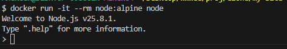

##  Проверить Docker
Получить версию установленного у вас Docker
```bash
docker version
```


## Подготовка Docker (чтобы начать работать с “чистого листа”)
Остановить все запущенные контейнеры
Удалить все остановленные контейнеры
Удалить все неиспользуемые образы

- Следует убедиться, нет ли у вас уже установленных и запущенных контейнеров:
```bash
docker ps -a
```
- Если есть, то лучше их остановить:
```bash
docker stop $(docker ps -q)
```
- Если остановленные контейнеры не нужно, то удалить их:
```bash
docker container prune
```
или
```bash
docker container prune $(docker ps -q)
```
- Ещё раз убедиться, что нет лишних контейнеров:
```bash
docker ps -a
```


- Опционально можно удалить ненужные образы. Показать текущие образы:
```bash
docker images
```
- Удалить все ненужные образы
```bash
docker image prune -a
```
или
```bash
docker rmi $(docker images -q)
```

## Поиск готового образа Node.js
```bash
docker run -it --rm node:alpine node
```

##  Получение готового образа Node.js

Получить информацию по загруженному образу:
```bash
docker inspect trusting_easley
```
При необходимости остановить контейнер с таким именем:
```bash
docker stop trusting_easley
```
Перезапустить контейнер по имени
```bash
docker restart trusting_easley
```
Перезапустить контейнер по его id
```bash
docker restart 5209bcaca983
```
Удалить выбранный контейнер по его имени
```bash
docker rm trusting_easley
```


И можно удалить ещё и образ загруженного ранее Node.js:

Получить id образа
```bash
docker images
```
Удалить по id нужный образ
```bash
docker rmi 5209bcaca983
```


## Проверить работу контейнера

Можно снова установить и запустить Node.js (если его удаляли ранее)
```bash
docker run -it --rm node:alpine node
```



Остановить все запущенные контейнеры
```bash
docker stop $(docker ps -q)
```
Удалить все остановленные контейнеры
```bash
docker container prune $(docker ps -q)
```
Удалить все образы
```bash
docker rmi $(docker images -q)
```