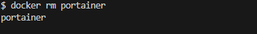
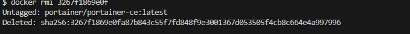
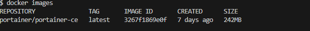
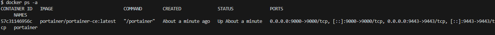
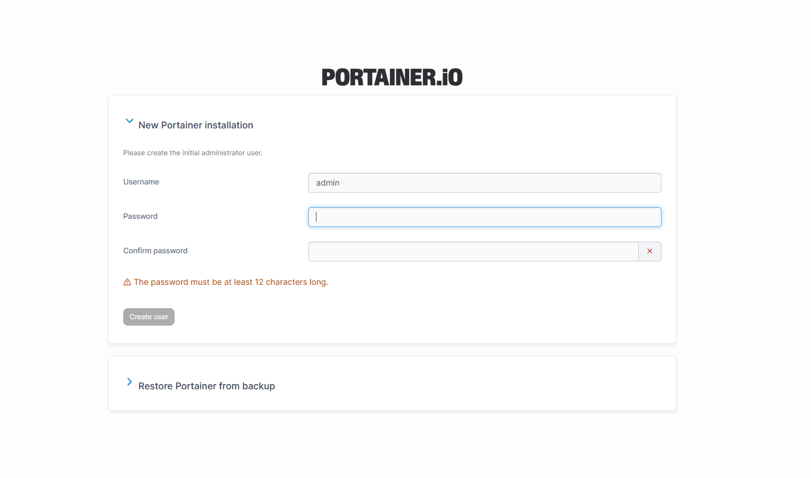
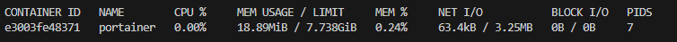
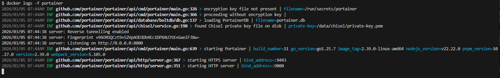
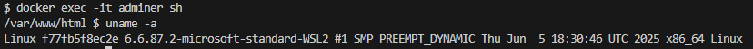
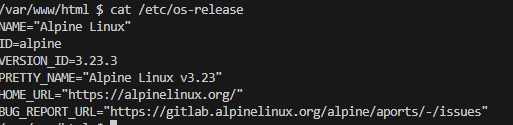

##  Проверить Docker
Получить версию установленного у вас Docker
```bash
docker version
```


## Подготовка Docker (чтобы начать работать с “чистого листа”)
Остановить все запущенные контейнеры
Удалить все остановленные контейнеры
Удалить все неиспользуемые образы

- Следует убедиться, нет ли у вас уже установленных и запущенных контейнеров:
```bash
docker ps -a
```
- Если есть, то лучше их остановить:
```bash
docker stop $(docker ps -q)
```
- Если остановленные контейнеры не нужно, то удалить их:
```bash
docker container prune
```
или
```bash
docker container prune $(docker ps -q)
```
- Ещё раз убедиться, что нет лишних контейнеров:
```bash
docker ps -a
```


- Опционально можно удалить ненужные образы. Показать текущие образы:
```bash
docker images
```
- Удалить все ненужные образы
```bash
docker image prune -a
```
или
```bash
docker rmi $(docker images -q)
```

## Поиск готового образа Portainer
```bash
docker run -d \
  --name portainer \
  -p 9000:9000 \
  -p 9443:9443 \
  -v /var/run/docker.sock:/var/run/docker.sock \
  -v portainer_data:/data \
  --restart unless-stopped \
  portainer/portainer-ce:latest
```

##  Получение готового образа Portainer

Получить информацию по загруженному образу:
```bash
docker inspect portainer
```
При необходимости остановить контейнер с таким именем:
```bash
docker stop portainer
```
Перезапустить контейнер по имени
```bash
docker restart portainer
```
Перезапустить контейнер по его id
```bash
docker restart 3267f1869e0f
```
Удалить выбранный контейнер по его имени
```bash
docker rm portainer
```


И можно удалить ещё и образ загруженного ранее Portainer:

Получить id образа
```bash
docker images
```
Удалить по id нужный образ
```bash
docker rmi 3267f1869e0f
```


## Проверить работу контейнера

Можно снова установить и запустить Portainer (если его удаляли ранее)
```bash
docker run -d \
  --name portainer \
  -p 9000:9000 \
  -p 9443:9443 \
  -v /var/run/docker.sock:/var/run/docker.sock \
  -v portainer_data:/data \
  --restart unless-stopped \
  portainer/portainer-ce:latest
```
Показать наличие загруженного файла образа
```bash
docker images
```


Показать только запущенные контейнеры
```bash
docker ps
```
или показать все контейнеры (в т.ч. остановленные)
```bash
docker ps -a
```


Проверить порт 9000 для Linux/Mac/WSL:
```bash
# Проверьте, занят ли порт
netstat -tuln | grep :9000
```
Проверить порт 8040 для Windows:
```bash
netstat -aon | findstr :9000
```
Откройте: http://localhost:9000



## Управление контейнером
Показать состояние всех контейнеров
```bash
docker ps -a
```
Показать подробности о контейнере
```bash
docker inspect portainer
```
Запустить мониторинг контейнеров
```bash
docker stats
```


Получить лог контейнера
```bash
docker logs portainer
```
Показать логи в режиме ожидания
```bash
docker logs -f portainer
```


Остановить контейнер
```bash
docker stop portainer
```
Снова запустить контейнер
```bash
docker start portainer
```
Перезапустить контейнер
```bash
docker restart portainer
```
Зайти в контейнер
```bash
docker exec -it portainer /bin/bash
```
или
```bash
docker exec -it portainer bash
```
или
```bash
docker exec -it portainer /bin/sh
```
или
```bash
docker exec -it portainer sh
```
внутри контейнера можно повыполнять некоторые команды Linux Получить информацию об ОС контейнера
```bash
uname -a
```



Получить больше информации об ОС контейнера
```bash
cat /etc/os-release
```



Выйти из контейнера можно командой exit

Остановить все запущенные контейнеры
```bash
docker stop $(docker ps -q)
```
Удалить все остановленные контейнеры
```bash
docker container prune $(docker ps -q)
```
Удалить все образы
```bash
docker rmi $(docker images -q)
```