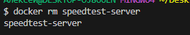
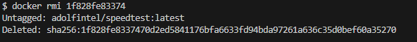
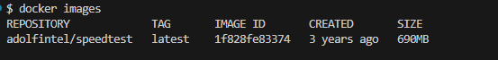
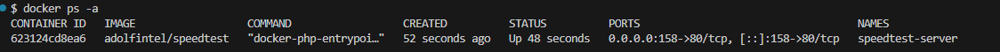
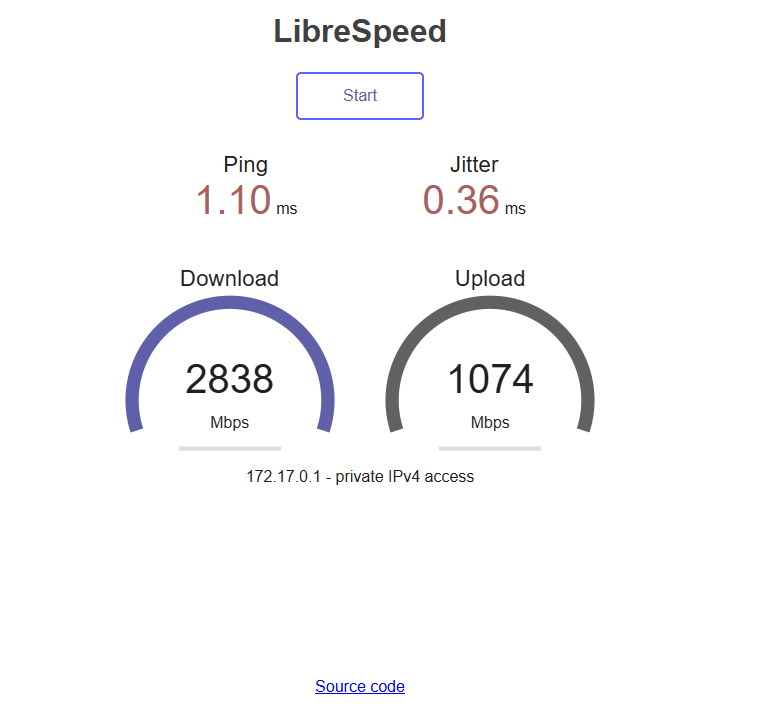

##  Проверить Docker
Получить версию установленного у вас Docker
```bash
docker version
```


## Подготовка Docker (чтобы начать работать с “чистого листа”)
Остановить все запущенные контейнеры
Удалить все остановленные контейнеры
Удалить все неиспользуемые образы

- Следует убедиться, нет ли у вас уже установленных и запущенных контейнеров:
```bash
docker ps -a
```
- Если есть, то лучше их остановить:
```bash
docker stop $(docker ps -q)
```
- Если остановленные контейнеры не нужно, то удалить их:
```bash
docker container prune
```
или
```bash
docker container prune $(docker ps -q)
```
- Ещё раз убедиться, что нет лишних контейнеров:
```bash
docker ps -a
```


- Опционально можно удалить ненужные образы. Показать текущие образы:
```bash
docker images
```
- Удалить все ненужные образы
```bash
docker image prune -a
```
или
```bash
docker rmi $(docker images -q)
```

## Поиск готового образа Speedtest
```bash
docker run -d -p 158:80 --name speedtest-server adolfintel/speedtest
```

##  Получение готового образа Speedtest

Получить информацию по загруженному образу:
```bash
docker inspect speedtest-server
```
При необходимости остановить контейнер с таким именем:
```bash
docker stop speedtest-server
```
Перезапустить контейнер по имени
```bash
docker restart speedtest-server
```
Перезапустить контейнер по его id
```bash
docker restart 1f828fe83374
```
Удалить выбранный контейнер по его имени
```bash
docker rm speedtest-server
```


И можно удалить ещё и образ загруженного ранее Speedtest:

Получить id образа
```bash
docker images
```
Удалить по id нужный образ
```bash
docker rmi 1f828fe83374
```


## Проверить работу контейнера

Можно снова установить и запустить Speedtest (если его удаляли ранее)
```bash
docker run -d -p 158:80 --name speedtest-server adolfintel/speedtest
```
Показать наличие загруженного файла образа
```bash
docker images
```


Показать только запущенные контейнеры
```bash
docker ps
```
или показать все контейнеры (в т.ч. остановленные)
```bash
docker ps -a
```


Проверить порт 158 для Linux/Mac/WSL:
```bash
# Проверьте, занят ли порт
netstat -tuln | grep :158
```
Проверить порт 8040 для Windows:
```bash
netstat -aon | findstr :158
```
Откройте: http://localhost:158



Остановить все запущенные контейнеры
```bash
docker stop $(docker ps -q)
```
Удалить все остановленные контейнеры
```bash
docker container prune $(docker ps -q)
```
Удалить все образы
```bash
docker rmi $(docker images -q)
```