##  Проверить Docker
Получить версию установленного у вас Docker
```bash
docker version
```

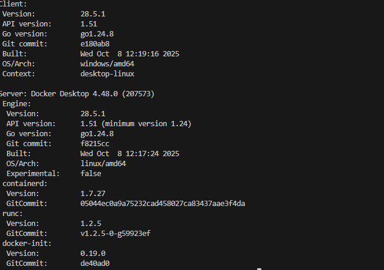

## Подготовка Docker (чтобы начать работать с “чистого листа”)
Остановить все запущенные контейнеры
Удалить все остановленные контейнеры
Удалить все неиспользуемые образы

- Следует убедиться, нет ли у вас уже установленных и запущенных контейнеров:
```bash
docker ps -a
```
- Если есть, то лучше их остановить:
```bash
docker stop $(docker ps -q)
```
- Если остановленные контейнеры не нужно, то удалить их:
```bash
docker container prune
```
или
```bash
docker container prune $(docker ps -q)
```
- Ещё раз убедиться, что нет лишних контейнеров:
```bash
docker ps -a
```

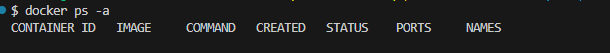

- Опционально можно удалить ненужные образы. Показать текущие образы:
```bash
docker images
```
- Удалить все ненужные образы
```bash
docker image prune -a
```
или
```bash
docker rmi $(docker images -q)
```

## Поиск готового образа Ubuntu
```bash
docker run -it --rm ubuntu:latest /bin/bash
```

##  Получение готового образа Ubuntu

Получить информацию по загруженному образу:
```bash
docker inspect sweet_gates
```
При необходимости остановить контейнер с таким именем:
```bash
docker stop sweet_gates
```
Перезапустить контейнер по имени
```bash
docker restart sweet_gates
```
Перезапустить контейнер по его id
```bash
docker restart d1e2e92c075e
```
Удалить выбранный контейнер по его имени
```bash
docker rm sweet_gates
```
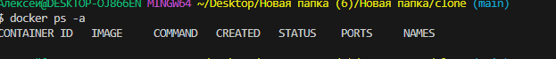

И можно удалить ещё и образ загруженного ранее Ubuntu:

Получить id образа
```bash
docker images
```
Удалить по id нужный образ
```bash
docker rmi d1e2e92c075e
```
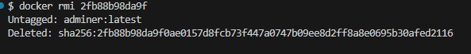

## Проверить работу контейнера

Можно снова установить и запустить Ubuntu (если его удаляли ранее)
```bash
docker run -it --rm ubuntu:latest /bin/bash
```
Показать наличие загруженного файла образа
```bash
docker images
```
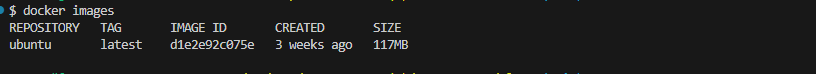

Показать только запущенные контейнеры
```bash
docker ps
```
или показать все контейнеры (в т.ч. остановленные)
```bash
docker ps -a
```
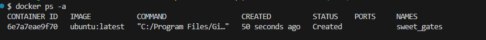

## Управление контейнером
Мониторинг контейнеров
Показать состояние всех контейнеров
```bash
docker ps -a
```
Показать подробности о контейнере
```bash
docker inspect sweet_gates
```
Запустить мониторинг контейнеров
```bash
docker stats
```
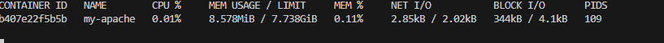

Получить лог контейнера
```bash
docker logs sweet_gates
```
Показать логи в режиме ожидания
```bash
docker logs -f sweet_gates
```
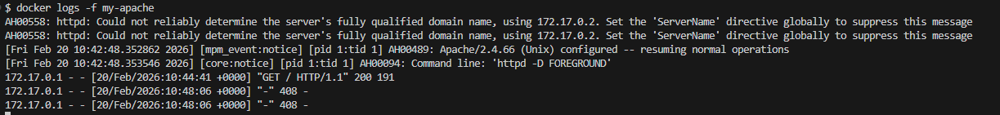

Остановить контейнер
```bash
docker stop sweet_gates
```
Снова запустить контейнер
```bash
docker start sweet_gates
```
Перезапустить контейнер
```bash
docker restart sweet_gates
```
Зайти в контейнер
```bash
docker exec -it sweet_gates /bin/bash
```
или
```bash
docker exec -it sweet_gates bash
```
или
```bash
docker exec -it sweet_gates /bin/sh
```
или
```bash
docker exec -it sweet_gates sh
```
внутри контейнера можно повыполнять некоторые команды Linux Получить информацию об ОС контейнера
```bash
uname -a
```

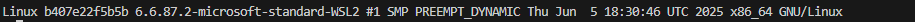

Получить больше информации об ОС контейнера
```bash
cat /etc/os-release
```

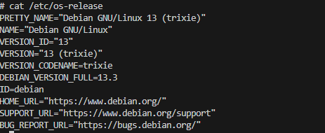

Установить Fastfetch
```bash
apt update && apt install -y fastfetch
```
```bash
fastfetch
```

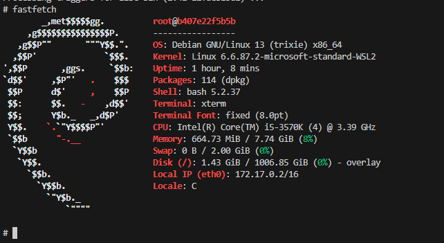

Можно установить ещё несколько приложений внутри Docker-контейнера:
```bash
apt update && apt install -y fastfetch htop cmatrix hollywood mc micro
```
и позапускать их отдельно друг от друга:
```bash
htop
```

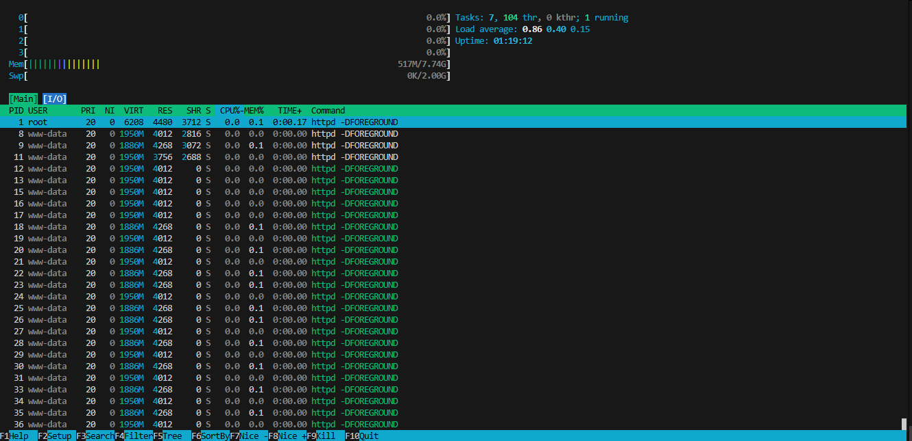

```bash
cmatrix
```

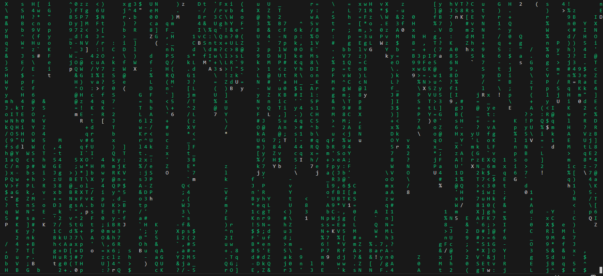

```bash
hollywood
```

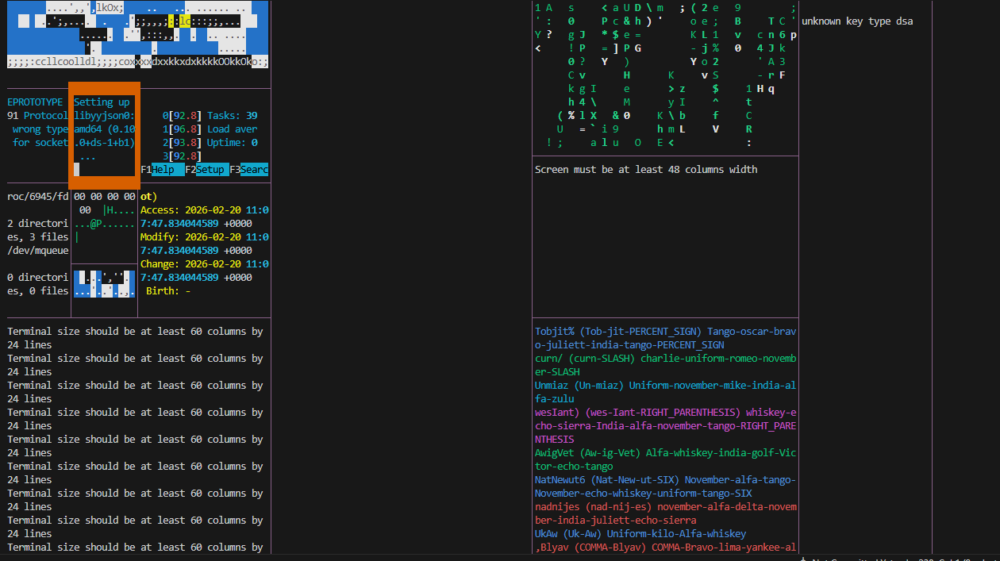

Выйти из контейнера можно командой exit

Остановить все запущенные контейнеры
```bash
docker stop $(docker ps -q)
```
Удалить все остановленные контейнеры
```bash
docker container prune $(docker ps -q)
```
Удалить все образы
```bash
docker rmi $(docker images -q)
```